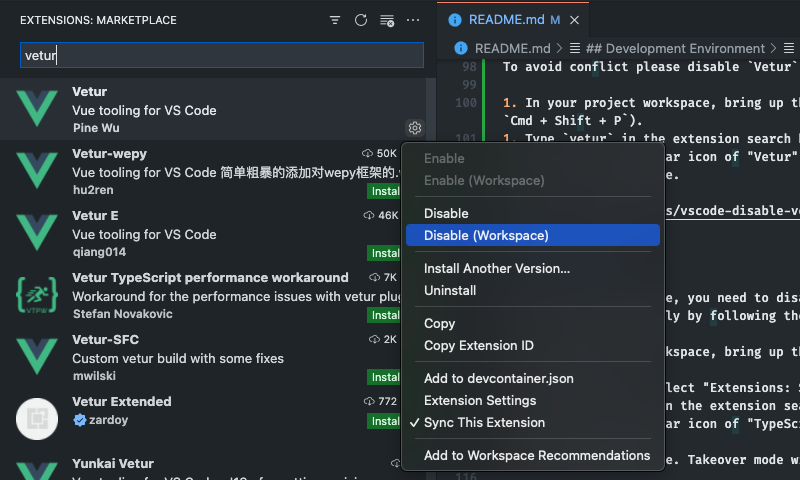

# IDE Support

The recommended IDE setup is [VSCode](https://code.visualstudio.com/) + the Volar extension. Volar provides syntax highlighting, TypeScript support, and intellisense for template expressions and component props.

See [Vue.js Docs for IDE Support](https://vuejs.org/guide/scaling-up/tooling.html#ide-support) for details.

## Out-of-box Experience

::: tip
We also have our own Visual Studio Code's [Extension Pack](https://marketplace.visualstudio.com/items?itemName=soramitsukhmer.vscode-frontend-pack) for quickly install all the necessary extension for Frontend Development.
:::

**Install from Marketplace**

[Click here to Install](vscode:extension/soramitsukhmer.vscode-frontend-pack)

**or Manual Install**

```sh
$ code --install-extension soramitsukhmer.vscode-frontend-pack
```

## Development Environment

This is strongly recommended for its great out-of-the-box support for Vue.js.

See [Using Vue with TypeScript](https://vuejs.org/guide/typescript/overview.html#using-vue-with-typescript) for details.

### Extensions
Install [Soramitsu Khmer's Extension Pack for Frontend Developers](https://marketplace.visualstudio.com/items?itemName=soramitsukhmer.vscode-frontend-pack) extension pack for Vue.js support and other tool sets.

## Takeover Mode

To enable Takeover Mode, you need to disable VSCode's built-in TS language service in your project's workspace only by following these steps:

1. In your project workspace, bring up the command palette with `Ctrl + Shift + P` (macOS: `Cmd + Shift + P`).
1. Type `built` and select "Extensions: Show Built-in Extensions".
1. Type `typescript` in the extension search box (do not remove `@builtin` prefix).
1. Click the little gear icon of "TypeScript and JavaScript Language Features", and select "Disable (Workspace)".
1. Reload the workspace. Takeover mode will be enabled when you open a Vue or TS file.


See [Enable Takeover Mode](https://vuejs.org/guide/typescript/overview.html#takeover-mode) for details.

## Disable Vetur

> This project have been switched to use the new `Vue Language Features (Volar)`.  
> You may need to disable `Vetur` if you have it installed.

To avoid conflict please disable `Vetur` it you have it install.

1. In your project workspace, bring up the command palette with `Ctrl + Shift + P` (macOS: `Cmd + Shift + P`).
1. Type `vetur` in the extension search box.
1. Click the little gear icon of "Vetur", and select "Disable (Workspace)".
1. Reload the workspace.


